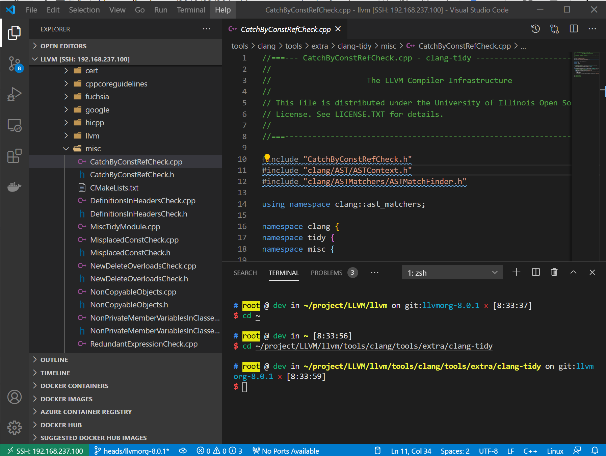
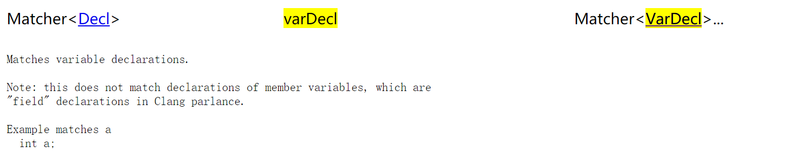
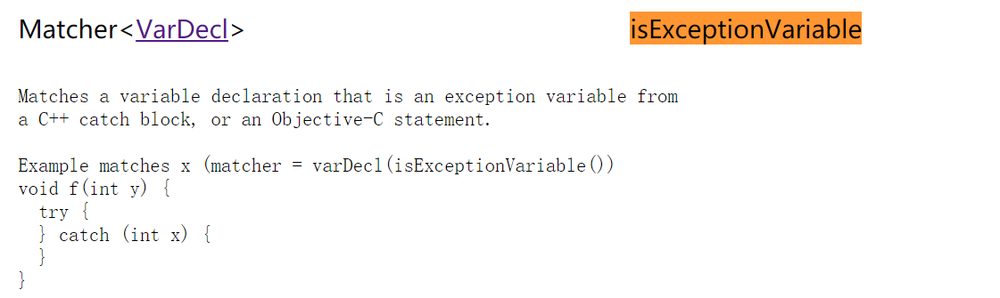
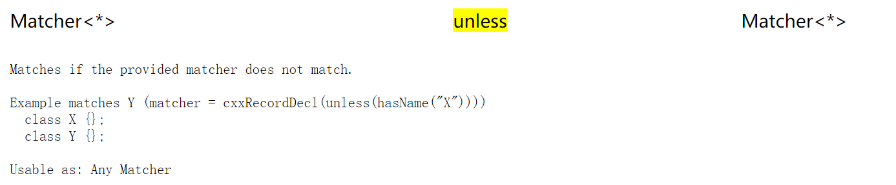
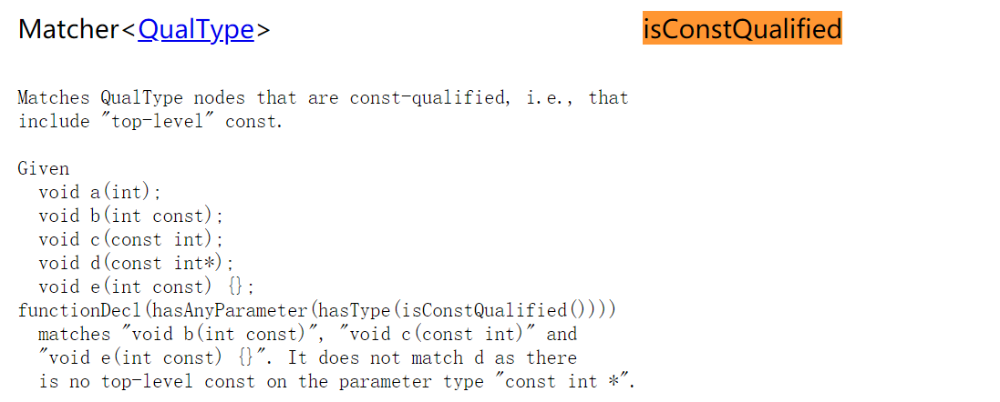
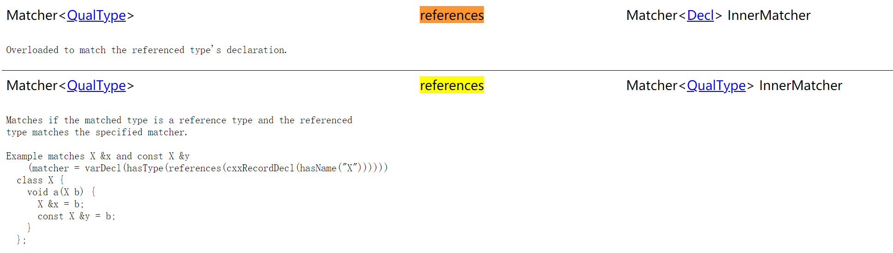

#  clang-tidy自定义check

参考了两篇[Writing a basic clang static analysis check, 2015](http://bbannier.github.io/blog/2015/05/02/Writing-a-basic-clang-static-analysis-check.html)，[Writing Custom Checks For Clang-Tidy, 2018](http://blog.audio-tk.com/2018/03/20/writing-custom-checks-for-clang-tidy/)，本文实践了一下，基于LLVM-8.0.1分支，misc-catch-by-const-ref check的[commit](https://gitee.com/jahentao/LLVM/commit/9f30b221a13fb7ba9619e7e98c91c3cfa228799d)（gitee可以[下载](https://gitee.com/jahentao/LLVM/commit/9f30b221a13fb7ba9619e7e98c91c3cfa228799d.diff)，很方便~）。

编译<!-- 这种包含关系我还不清楚 -->

```bash
make check-clang-tools -j2 # 编译包含clang-tidy
make clang-check -j2 # 编译保护clang-check
```

在添加自定义check前，第一步要先将原有的clang-tidy编译出来，为了后续学习，编译带有debug信息`-DCMAKE_BUILD_TYPE=RelWithDebInfo`，带debug信息生成的clang-tidy有1.3G /(ㄒoㄒ)/~~。

详细的LLVM-8环境搭建，详见[Unix LLVM-8安装](./install.md)。

<!-- 可能写的有些零散，因为我也没有建立完整的认识 -->

## check实现的流程

clang-tidy是强大的静态分析工具。其中，已经实现了很多检查（check）。

1. 生成自定义检查代码框架。在LLVM/clang-tools-extra/clang-tidy下有个脚本`add_new_check.py`。<!-- TODO 还没细看实现 -->

   ```bash
   ./add_new_check.py misc catch-by-const-ref
   ```

   `misc-catch-by-const-ref`用于检查`catch()`语句中的变量是否声明为常量。

   会创建和修改一些文件：

   ```bash
   $ git log -p -1 --name-status
   M       clang-tools-extra/clang-tidy/misc/CMakeLists.txt
   A       clang-tools-extra/clang-tidy/misc/CatchByConstRefCheck.cpp
   A       clang-tools-extra/clang-tidy/misc/CatchByConstRefCheck.h
   M       clang-tools-extra/clang-tidy/misc/MiscTidyModule.cpp
   M       clang-tools-extra/docs/ReleaseNotes.rst
   M       clang-tools-extra/docs/clang-tidy/checks/list.rst
   A       clang-tools-extra/docs/clang-tidy/checks/misc-catch-by-const-ref.rst
   A       clang-tools-extra/test/clang-tidy/misc-catch-by-const-ref.cpp
   ```

   VS Code查看和编辑代码

   

   我们逐个去编辑和了解主要的几个文件。

2. `misc/CatchByConstRefCheck.cpp`这是实现`misc-catch-by-const-ref`检查的主要文件，对应的头文件是`misc/CatchByConstRefCheck.h`。 `CatchByConstRefCheck`继承自`ClangTidyCheck`需要实现两个虚函数。

   ```c++
   virtual void registerMatchers(ast_matchers::MatchFinder *Finder) {}
   
   virtual void check(const ast_matchers::MatchFinder::MatchResult &Result) {}
   ```

   `registerMatchers`通过`Finder`注册AST Matcher。注册匹配器最重要的是**编写匹配规则**，详见下文，这是clang-tidy框架抽象的地方，交给开发者的工作。所有匹配都是按照AST遍历的顺序出现的。可以使用Finder注册任意数量的匹配器。

   不同的匹配器可以触发不同的**回调**，通常“this”将被用作回调。如果需要合并不同匹配器之间的信息，可以将它们存储为派生类的成员。

   还有一个`registerPPCallbacks`虚函数按需实现，用于分析与预处理器相关的属性的clang-tidy检查，例如include指令符的顺序。

   ```c++
   virtual void registerPPCallbacks(CompilerInstance &Compiler) {}
   virtual void storeOptions(ClangTidyOptions::OptionMap &Options) {}
   ```

   

3. 分析clang AST，根据check需要，**创建匹配器**（matcher ）是重要的第一步，官方文档[Matching the Clang AST](https://releases.llvm.org/8.0.1/tools/clang/docs/LibASTMatchers.html)。

   在Clang AST中有超过一千个类，当试图弄清楚如何为特定模式创建匹配器时，可能会很快迷失。使用匹配器的前提是了解要匹配的AST的外观。前置要求了解clang AST的结构，参考[clang AST介绍](./clang-ast-structure.md)。

   > In general, the strategy to create the right matchers is:
   >
   > 1. Find the outermost class in Clang’s AST you want to match.
   > 2. Look at the [AST Matcher Reference](https://releases.llvm.org/8.0.1/tools/clang/docs/LibASTMatchersReference.html) for matchers that either match the node you’re interested in or narrow down attributes on the node.
   > 3. Create your outer match expression. Verify that it works as expected.
   > 4. Examine the matchers for what the next inner node you want to match is.
   > 5. Repeat until the matcher is finished.

   先借助clang-check分析测试用例，编写测试用例`test/clang-tidy/misc-catch-by-const-ref.cpp`，用例驱动开发。参考[clang-check构建与学习](https://releases.llvm.org/8.0.1/tools/clang/docs/HowToSetupToolingForLLVM.html)。

   - 编写匹配器：先用clang-check分析程序结构。

     ```bash
     bin/clang-check -ast-dump ../../clang-tools-extra/test/clang-tidy/misc-catch-by-const-ref.cpp --
     ```

     clang-check常用选项：

     - `-ast-print` 构建AST，pretty-print。
     - `-ast-dump` 构建AST，debug dump。
     - `-ast-dump-filter=<string>`字符串子串匹配，过滤打印相应节点。

     分析输出：

     ```bash
     $ bin/clang-check -ast-print -ast-dump-filter="catch" ../../clang-tools-extra/test/clang-tidy/misc-catch-by-const-ref.cpp --
     Printing catchbyRef:
     void catchbyRef() {
         try {
             check();
         } catch (logic_error &e) {
         }
     }
     
     Printing catchbyConstRef:
     void catchbyConstRef() {
         try {
             check();
         } catch (const logic_error &e) {
         }
     }
     ```

     AST输出

     ```bash
     $ bin/clang-check -ast-dump -ast-dump-filter="catch" ../../clang-tools-extra/test/clang-tidy/misc-catch-by-const-ref.cpp --
     Dumping catchbyRef:
     FunctionDecl 0x9e89e30 </root/project/LLVM/llvm/build/../../clang-tools-extra/test/clang-tidy/misc-catch-by-const-ref.cpp:12:1, line:19:1> line:12:6 catchbyRef 'void ()'
     `-CompoundStmt 0x9e8a098 <col:19, line:19:1>
       `-CXXTryStmt 0x9e8a078 <line:13:3, line:18:3>
         |-CompoundStmt 0x9e89f90 <line:13:7, line:15:3>
         | `-CallExpr 0x9e89f70 <line:14:5, col:11> 'void'
         |   `-ImplicitCastExpr 0x9e89f58 <col:5> 'void (*)()' <FunctionToPointerDecay>
         |     `-DeclRefExpr 0x9e89f10 <col:5> 'void ()' lvalue Function 0x9e89d28 'check' 'void ()'
         `-CXXCatchStmt 0x9e8a058 <line:15:5, line:18:3>
           |-VarDecl 0x9e89fe8 <line:15:12, col:25> col:25 e 'logic_error &'
           `-CompoundStmt 0x9e8a048 <col:28, line:18:3>
     
     Dumping catchbyConstRef:
     FunctionDecl 0x9e8a0d0 </root/project/LLVM/llvm/build/../../clang-tools-extra/test/clang-tidy/misc-catch-by-const-ref.cpp:21:1, line:26:1> line:21:6 catchbyConstRef 'void ()'
     `-CompoundStmt 0x9e8a308 <col:24, line:26:1>
       `-CXXTryStmt 0x9e8a2e8 <line:22:3, line:25:3>
         |-CompoundStmt 0x9e8a208 <line:22:7, line:24:3>
         | `-CallExpr 0x9e8a1e8 <line:23:5, col:11> 'void'
         |   `-ImplicitCastExpr 0x9e8a1d0 <col:5> 'void (*)()' <FunctionToPointerDecay>
         |     `-DeclRefExpr 0x9e8a1b0 <col:5> 'void ()' lvalue Function 0x9e89d28 'check' 'void ()'
         `-CXXCatchStmt 0x9e8a2c8 <line:24:5, line:25:3>
           |-VarDecl 0x9e8a258 <line:24:12, col:31> col:31 e 'const logic_error &'
           `-CompoundStmt 0x9e8a2b8 <col:34, line:25:3>
     ```

     使用`clang-query`尝试拼凑匹配表达式

     ```
     clang-query ../../clang-tools-extra/test/clang-tidy/misc-catch-by-const-ref.cpp --
     ```

     对照上面第6行，我们要匹配`logic_error &e`，它的特点是：

     - 变量声明
     - 在catch语句中
     - 是一个引用
     - 但没有被const修饰

     ```
         } catch (logic_error &e) {
     ```

     对照上面第11行，我们想匹配的是`VarDecl`

     ```bash
     |-VarDecl 0x9e89fe8 <line:15:12, col:25> col:25 e 'logic_error &'
     ```

     [AST Matcher Reference](https://releases.llvm.org/8.0.1/tools/clang/docs/LibASTMatchersReference.html)按Matcher匹配的类别和节点类型分组，将分为了三类：

     - [Node Matchers](https://releases.llvm.org/8.0.1/tools/clang/docs/LibASTMatchersReference.html#decl-matchers)（节点匹配器）：与特定类型的AST节点匹配的匹配器。
     - [Narrowing Matchers](https://releases.llvm.org/8.0.1/tools/clang/docs/LibASTMatchersReference.html#narrowing-matchers)（缩小匹配器）：匹配AST节点上的属性的匹配器。
     - [Traversal Matchers](https://releases.llvm.org/8.0.1/tools/clang/docs/LibASTMatchersReference.html#traversal-matchers) （遍历匹配器）：允许在AST节点之间遍历的匹配器。

     在[AST Matcher Reference](https://releases.llvm.org/8.0.1/tools/clang/docs/LibASTMatchersReference.html)搜索`VarDecl`

     

     按照上述4点特征，拼凑匹配器：

     - 变量声明与**varDecl**匹配（对于类型VarDecl，请注意大小写差异）
     - catch语句内的匹配项是**isExceptionVariable**
     - 引用类型的匹配项是**references**
     - const方面由**isConstQualified**匹配

     ```c++
     varDecl(isExceptionVariable(),hasType(references(qualType(unless(isConstQualified()))))
            )
     ```

     `varDecl` 是与`VarDecl`匹配的[`VariadicDynCastAllOfMatcher`](https://releases.llvm.org/8.0.1/tools/clang/docs/LibASTMatchers.html#writing-your-own-matchers)的实例。它可以采用多个参数。因此，第一个参数设为`isExceptionVariable`，第二个描述我们正在寻找的`hasType(references(qualType(unless(isConstQualified()))))`的访问类型。从字面意思，从内向外展开此匹配表达式，我们正在的是寻找的是：不包括（`unless`）const限定（`isConstQualified`）的限定符类型（`qualType`）的参考（`references`）。

     

     

     

     

     

     有多个匹配器定义宏，它们处理多态返回值和不同的参数计数。参见[ASTMatchersMacros.h](https://clang.llvm.org/doxygen/ASTMatchersMacros_8h.html)。

   - 在匹配表达式中绑定节点

     与特定AST节点匹配的匹配器，所谓的节点匹配器（node matchers），是**可绑定的**。例如，`recordDecl(hasName("MyClass")).bind("id")`。`bind("id")`会将匹配的`recordDecl`节点绑定到字符串`"id"`，以便稍后在match回调中检索。

     ```c++
     .bind("catch")
     ```
     
     

4. 重要的第二步，实现`check`，并添加修复（按需）

   - 运行测试用例：

5. 从用户角度使用clang-tidy测试一下。

   禁用所有默认检查（`-*`）并启用`misc-catch-by-const-ref`检查；`--`后面可以传递给clang编译器的编译选项，它可以防止clang-tidy搜索编译数据库。

```bash
$ bin/clang-tidy -checks='-*,misc-catch-by-const-ref' -list-checks
Enabled checks:
    misc-catch-by-const-ref
    
$ bin/clang-tidy -checks='-*,misc-catch-by-const-ref' ../../clang-tools-extra/test/clang-tidy/misc-catch-by-const-ref.cpp --
1 warning generated.
/root/project/LLVM/llvm/build/../../clang-tools-extra/test/clang-tidy/misc-catch-by-const-ref.cpp:15:12: warning: catch handler catches by non const reference; catching by const-reference may be more efficient [misc-catch-by-const-ref]
  } catch (logic_error& e) {
           ^
           const

```

`-f`选项可自动修复。

更多的学习，查看[cfe-dev邮件列表]()。<!-- TODO　我想给仓库添加文档链接扫描，之后加一些没有加的链接加上。也可以从链接的角度整理有用的链接 -->

## 学习已有check

clang-tidy的使用详见[clang-tidy官方文档](http://clang.llvm.org/extra/clang-tidy/)，（8.0.1版本[Clang-Tidy — Extra Clang Tools 8 documentation (llvm.org)](https://releases.llvm.org/8.0.1/tools/clang/tools/extra/docs/clang-tidy/)），clang-tidy基于[LibTooling](https://releases.llvm.org/8.0.1/tools/clang/docs/LibTooling.html)，有编译命令数据库，可以建立AST。

“Clang提供了基础架构和工具，使用户可以专注于实际问题，编写C ++代码的自定义静态分析检查从未如此简单。”

|      |      |      |
| ---- | ---- | ---- |
|      |      |      |
|      |      |      |
|      |      |      |

1. 可以通过[`CXXRecordDecl::forallBases`](http://clang.llvm.org/doxygen/classclang_1_1CXXRecordDecl.html)，遍历基类。接口声明不同版本有变动，以LLVM 8为例，如下：

   ```c++
   bool CXXRecordDecl::forallBases(ForallBasesCallback BaseMatches,
                                   bool AllowShortCircuit) const
   ```

   

2. d