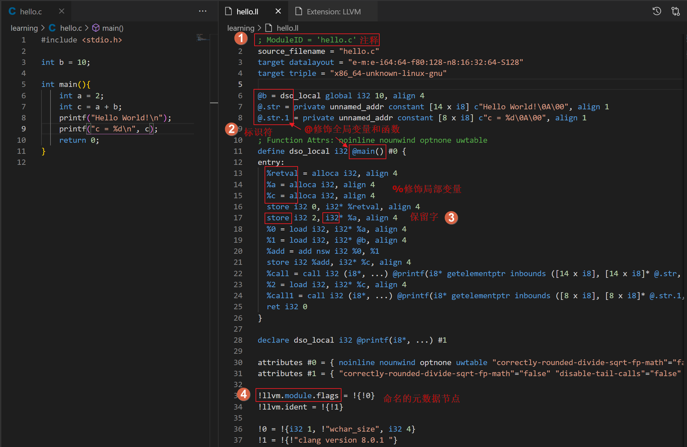
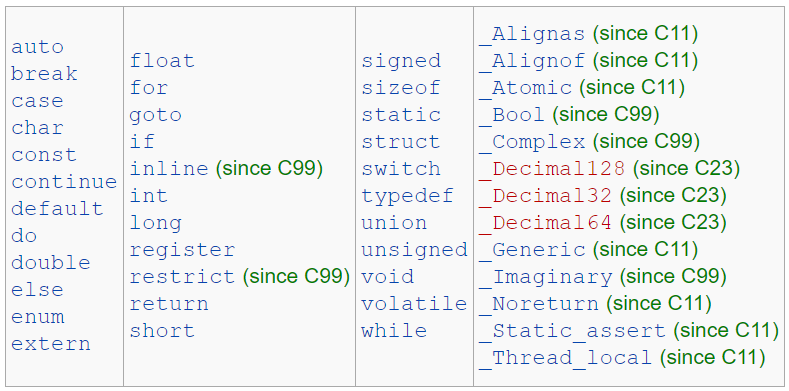
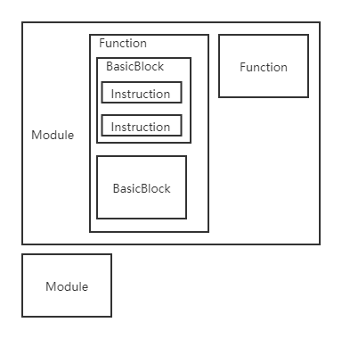
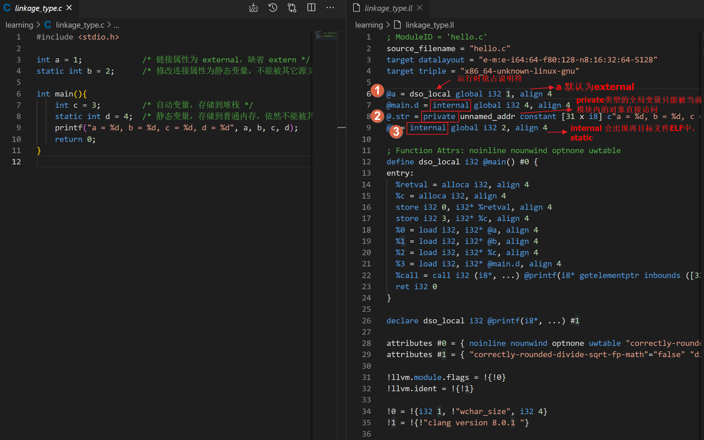

内容框架，包含：

- 中间表示的语法（函数定义、Intrinsic、metadata，校验IR的工具），参考LLVM Language Reference Manual[^4].

- LLVM的前端被认为是LLVM IR的parser

- IR相关API[1][1]

  LLVM IR这个术语专指Instruction类所代表的不同后端共享的中间表示。by the way, 从这个角度理解IR的三种形式。

  LLVM IR的三种等价表达形式：内存表示（Instruction类等）；磁盘表示，压缩的`.bc`；磁盘表示，人工可读的`.ll`；

  LLVM IR对编译目标的依赖根植于C/C++语言固有的目标依赖性质。需要与内核的**系统调用**期望的类型相匹配。

描述摘录：

1. 中间语言的结构和特征
   本质上中间语言对生成的代码的正确性没有影响, 然而中间语言的结构影响对自动代码生成算法的设计.


学习LLVM IR 语法最好的参考，就是[LLVM Language Reference Manual](https://releases.llvm.org/8.0.0/docs/LangRef.html)。

关于LLVM IR，官方会议有个教程[LLVM IR Tutorialllvm.org](https://link.zhihu.com/?target=https%3A//llvm.org/devmtg/2019-04/slides/Tutorial-Bridgers-LLVM_IR_tutorial.pdf)，零基础，但只是讲了很少一部分。

## 简单了解SSA

有本讲SSA的小册子，这里有个SSA [视频](http://tobyho.com/video/LLVM-Tutorial-7-What-is-SSA.html)教程。

关于静态单赋值形式(static single assignment form, SSA)的，它是计算机程序低级表示中存储位置(变量)的命名约定。术语`static`表明SSA与程序文本(代码)的属性和分析有关。术语`single`指的是SSA赋予变量名的唯一性属性。如上所述，这可以实现更高程度的精度。**赋值**这个术语意味着各种各样的定义。例如：

```
x = y + 1;
```

变量x被赋值为表达式(y +1)。这是对x的一个定义或赋值语句。编译器工程师会把上面的赋值语句解释为x的左值(即标记为x的内存位置)应该被修改，以存储值(y + 1)。

PHI节点就是SSA表示中，表示基本块前驱的节点，因为不是固定的，运行时确定。

## 对比C语言学习LLVM IR语法

相同的地方就罗列对比学习

先列LLVM IR的形式，示例文件[hello.ll](demo/hello.ll)。

图示基本概念：




|          | LLVM IR                                                      | C                                                            |
| -------- | ------------------------------------------------------------ | ------------------------------------------------------------ |
| 注释     | <font size="1">; 单行注释</font>                             | <font size="1">// 单行注释    </font>                        |
| 标识符   | <font size="1">两种类型：通过**前缀**区分<br>1) global: @修饰函数、全局变量；<br>2) local: %修饰局部变量<br>三类：命名，未命名，常量<br>其中命名`[%@][-a-zA-Z$._][-a-zA-Z$._0-9]*`可以带'.'，甚至可以通过"\xx"转义包含任意字符;未命名的临时变量以前缀+数字，每个函数都有个递增器，数字从0开始</font> | <font size="1">标识符没有前缀标识，不能以数字开头，可以包含`_`。<br>全局变量和局部变量，就相当于C语言中的指针变量，函数就相当于C中的函数指针。<br>临时变量就相当于C语言中的普通变量。<br></font> |
| 保留字   | <font size="1">LLVM IR 本身的标注符`global`, `define`, `entry`,`label`, `attributes`等<br/>与操作符相关的一类：`store`, `add`, `bitcast`, `ret`等<br>与基本类型相关的一类：`i1`, `i32`, `void`等</font> | <font size="1">[关键字](https://en.cppreference.com/w/c/keyword)<br></font> |
| 层次结构 | <font size="1">- `Module`：多个模块可以被LLVM 链接器（linker）组合在一起。<br>- `Function`：被Module所包含，LLVM的Function包含函数名、函数的返回值和参数类型，Function内部则包含BasicBlock。<br>- `BasicBlock`：与编译技术中常见的基本块(basic block)的概念是一致的，BasicBlock必须有一个进入标签和一条结束指令。结束指令一般是`br`跳转指令或者`ret`返回执行。<br>- `Instruction`：就是上面提到过的“指令”，LLVM IR的最基本的单位，Instruction被包含在BasicBlock中，一个BasicBlock可以有多条Instruction。</font> | <font size="1">- 源文件<br>- 函数<br>- 语句<br> - 运算符</font> |
| 链接属性 | <font size="1">全局值（全局变量和函数）都由指向某个特定位置的指针表示，并且有一个链接类型：10种。<br/>1)private。private类型的全局变量只能被当前模块内的对象直接访问。而且，当将代码链接到一个包含private类型值的模块的时候，这个private值可能被重命名以避免冲突。由于这个值是模块私有的，所以所有的引用都可以直接更新。private的值不会出现在目标代码的符号表中。<br/>2)**internal**。与private类似，不过它的值会作为局部变量出现在目标文件中（ELF STB_LOCAL）。类似C语言中static的概念。<br/>3)available_externally。该类型的变量不会被输出到对应模块的目标文件中。对于链接者来说，该类型相当于一个外部声明。这种类型只允许在定义时使用，而不能在声明时使用。<br/>其他链接类型[^5]，按变量重名时的处理方式(linkonce, appending)，变量未使用是否丢弃(weak, extern_weak), 链接的变量定义是否等效(linkonce_odr, weak_odr)进行细分。extern_weak链接的语义遵循ELF对象文件模型。<br>10) 如果没有指定任意类型，那么就是**external**的。<br/></font> | <font size="1">变量的存储类型：<br>auto<br>static<br>register<br>变量的链接属性：<br>`external(外部)`<br>`internal(内部)`<br>`none(无)`<br>external和internal常用，**none**表示无链接属性，该标识符的多个声明被当成独立不同的实体。</font>[^6] |
| 函数     | <font size="1">函数就是一个个基本块(basicblock)构成了一个CFG(控制流程图)，每个基本块由一条条指令组成，并且都有一个进入标签(entry lable)和一条终止指令(Terminator Instructions)，终止指令有好多条，如br、ret、switch等。如果没有提供一个确切的标签名称，块(block)就会被分配一个隐式的标签编号，编号使用的是从计数器中返回下一个值，就如同未命名的临时变量一样。<br/>函数的定义用关键字`define`，函数的声明用关键字`declare`。</font> |                                                              |
| 元数据   | <font size="1">元数据没有类型，也不是值，语法上由`！`标识。有两类元数据原语：字符串和节点。 元数据类型被调用指令引用，可以**将有关代码的额外信息传达给优化器和代码生成器**。</font> | COMDAT                                                       |
| 属性     | <font size="1">Attribute用于描述函数的属性。如:`readonly`。</font> |                                                              |
| "库函数" | Intrinsic是直接由LLVM定义的内置函数，分为目标独立和目标相关的Intrinsic。<br>指令，如`load`, `store`,`alloca`,`icmp` | 内置函数, 库函数                                             |

1. LLVM的标识符通过**前缀**区分，不必担心与保留字冲突，保留字扩展方便。

2. LLVM IR的层次结构：



3. LLVM IR的组织方式，函数中有基本块，基本块中有指令。

4. C语言中的static涉及存储类型和链接类型：

- `static` 申明函数或代码块之外的变量时，只修改**链接属性** ``external` 为 `internal`，**存储类型**和**作用域**不变。
- `static` 申明代码块内部变量时，将自动变量修改为**静态变量**，但是**链接属性**和**作用域**不变。

5. 元数据Metadata。LLVM IR允许将元数据附加到程序中的指令，这些指令可以**将有关代码的额外信息传达给优化器和代码生成器**。元数据的一个示例应用是源级别的调试信息。

   元数据节点用类似于结构常量的符号表示（用逗号分隔的元素列表，用大括号括起来，并带有感叹号）。元数据节点可以具有任何值作为其操作数。

   ```
   !{ !"test\00", i32 10}
   ```

   不是唯一的元数据节点使用distinct关键字。当不应根据节点的内容合并节点时，使用不同的节点很有用。当元数据操作数更改时，转换导致唯一冲突时，也会发生这种情况。

   ```
   !0 = distinct !{!"test\00", i32 10}
   ```

   命名的元数据是元数据节点的集合，可以在模块符号表中查找这些元数据节点。例如：

   ```
   !foo = !{!4, !3}
   ```

   元数据可以用作函数参数。此处，llvm.dbg.value内部函数使用三个元数据参数：

   ```
   call void @llvm.dbg.value(metadata !24, metadata !25, metadata !26)
   ```

   

6. 函数中的第一个基本块有两个特殊点：只要进入该函数就立刻执行第一个基本块，并且不允许有祖先基本块（即不能有任何分支到函数的入口块）。由于该块可以没有前驱，所以它不能有任何`PHI`节点。

   LLVM函数由“define”关键字进行定义，每个函数都有一个可选的链接类型，一个可选的运行时抢占说明(runtime preemption specifier)，一个可选的可见性模式，一个可选的DLL存储类别，一个可选的调用约定，一个可选的unnamed_addr属性(该属性表示地址不重要，只要内容)，一个返回值类型，一个可选的返回类型的参数属性，一个函数名，一个（可能为空的）实参列表（每一个都带有可选的参数属性），可选的函数属性，一个可选的地址空间，一个可选的section(部分?这个词不知道该怎么翻译)，一个可选的对齐属性，一个可选的comdat(common data，公用数据)，一个可选的GC(垃圾回收器)名称，一个可选的前缀数据，一个可选的序言数据，一个可选的personality(有该属性的函数可以指定异常处理)，一个可选的附加元数据列表，一个左花括号，一个基本块列表和一个右花括号。

   函数的语法定义如下：

   ```
   define [linkage] [PreemptionSpecifier] [visibility] [DLLStorageClass]
          [cconv] [ret attrs]
          <ResultType> @<FunctionName> ([argument list])
          [(unnamed_addr|local_unnamed_addr)] [AddrSpace] [fn Attrs]
          [section "name"] [comdat [($name)]] [align N] [gc] [prefix Constant]
          [prologue Constant] [personality Constant] (!name !N)* { ... }
   ```

   阅读一个简单的函数，

   ```
   define i32 @max(i32 %a, i32 %b) #0 {
   entry:
     %retval = alloca i32, align 4
     %a.addr = alloca i32, align 4
     %b.addr = alloca i32, align 4
     store i32 %a, i32* %a.addr, align 4
     store i32 %b, i32* %b.addr, align 4
     %0 = load i32, i32* %a.addr, align 4
     %1 = load i32, i32* %b.addr, align 4
     %cmp = icmp sgt i32 %0, %1
     br i1 %cmp, label %if.then, label %if.else
   
   if.then:
     %2 = load i32, i32* %a.addr, align 4
     store i32 %2, i32* %retval, align 4
     br label %return
   
   if.else:
     %3 = load i32, i32* %b.addr, align 4
     store i32 %3, i32* %retval, align 4
     br label %return
   
   return:
     %4 = load i32, i32* %retval, align 4
     ret i32 %4
   }
   ```

   `define i32 @max(i32 %a, i32 %b) #0 {`定义一个函数，该函数的返回类型是`i32`，两个入参变量都是`i32`类型，`#0`引用一个属性组。

   进入一个基本块(basicblock)，开始标签是entry，结束是br跳转指令。里面的alloca是一条申请内存的指令，分别为三个变量申请三块内存；store是一个存值的指令，将某一个值放到刚申请的内存中；load是一个读取值的指令，将指定内存中的值读取出来；icmp是一个比较的指令，根据比较规则比较两个值的关系，返回一个布尔值，sgt就是比较规则，两个有符号的操作数进行大于比较；br是跳转指令，有条件跳转和无条件跳转，这里是条件跳转，根据%cmp的值来决定跳转到if.then基本块还是if.else基本块。

   后面三个分别是三个基本块(basicblock)，都有开始标签和结束指令，`br label %return`是一个无条件跳转；从这里可以看出来，llvm中没有if语句，而是用跳转实现了if，其实llvm也没有while循环，没有switch分支，全部都是用`判断+跳转`来实现的。

   最后阅读C源代码。果然是高级语言，手动狗头

   ```c
   int max(int a, int b){
       if(a > b)
   		return a;
       else
   		return b;
   }
   ```

   

7. 有关链接类型的理解，实验C代码

   ```c
   #include <stdio.h>
   
   int a = 1;             /* 链接属性为 external，缺省 extern */
   static int b = 2;      /* 修改连接属性为静态变量，不能被其它源文件访问，依然为全局变量，存储于静态内存中 */
   
   int main(){
       int c = 3;         /* 自动变量，存储到堆栈 */
     	static int d = 4;  /* 静态变量，存储到普通内存，依然不能被其它源文件访问 */
       printf("a = %d, b = %d, c = %d, d = %d", a, b, c, d);
       return 0;
   }
   ```

   对应LLVM IR的标识符

   用lli执行.ll文件

   ```
   $ lli linkage_type.ll 
   a = 1, b = 2, c = 3, d = 4# 
   ```

   所以可以手写LLM IR 作为练习。.ll格式和.bc格式转换的简单命令清单：

   - .c -> .ll：`clang -emit-llvm -S a.c -o a.ll`
   - .c -> .bc: `clang -emit-llvm -c a.c -o a.bc` 
   - .ll -> .bc: `llvm-as a.ll -o a.bc`
   - .bc -> .ll: `llvm-dis a.bc -o a.ll` 
   - .bc -> .s: `llc a.bc -o a.s`

   如果想要更详细地了解llvm的相关工具，请查阅官方文档 [LLVM CommandGuide](https://link.zhihu.com/?target=https%3A//llvm.org/docs/CommandGuide/index.html)。 对于clang，请查阅官方文档 [User Manual](https://link.zhihu.com/?target=https%3A//clang.llvm.org/docs/UsersManual.html)。

   

8. `dso_local`是运行时抢占说明符([runtime preemption](https://releases.llvm.org/8.0.0/docs/LangRef.html#runtime-preemption-model))。编译器可以假定标记为dso_local的函数或变量将解析为同一链接单元内的符号。即使定义不在此编译单元内，也将生成直接访问。

9. LLVM支持很多调用约定[(calling convention)](https://releases.llvm.org/8.0.0/docs/LangRef.html#callingconv)

   - C调用约定`ccc`。如果没有指定其他类型，那么就默认是这种类型。这个类型支持可变参数的函数调用并且允许声明的原型和函数声明的实现之间有一些不匹配。
   -  还有其他很多与其他的调用约定。

10. 可见性：所有的全局变量和函数都有一种可见性样式：<br/>“default”，默认样式。对于使用ELF（Executable and Linking Format）格式的目标文件，这种可见性样式意味着声明对其他模块可见；在共享库中，意味着声明的实体可以被重写；在Darwin，声明对其他模块可见。<br/>“hidden”。具有这种可见性样式的声明引用相同的对象，如果它们在相同的共享对象中的话。通常，具有这种可见性样式的符号不会出现在动态符号表中，所有其他模块不能直接引用它。<br/>“protected”。对于ELF，这种样式表明符号会放置在动态符号表中，但是在定义这个符号的模块中的引用会绑定到局部变量，也就是说这个符号不能被其他模块重写。<br/>


## 基于语法手写 LLVM IR .ll

`alias`

## 源码阅读

1. LLVM IR语言的OPCode定义在`llvm/include/llvm/IR/Instruction.def`，可以把看做LLVM Language Reference Manual看做Spec规范。

   文档和代码OPCode是对应的。LLVM IR的OPCode数量是固定的，不易扩展。

2. 


## 实验 IR 相关API

基于LLVM 8 的库，在源码外构建项目。

1. 实验生成IR IRBuilder

   IRBuilder操作`Value`, ``

   扩展：通过阅读clang了解IRBuilder。

2. 扩展LLVM IR方式一：Attribute，不推荐

3. 扩展LLVM IR方式二：Metadata

4. 扩展LLVM IR方式三：Intrinsic

5. 扩展LLVM IR方式四：OPCode，不推荐

## 详细了解SSA体系


[^1]: [LLVM IR CSDN分类专栏](https://blog.csdn.net/qq_42570601/category_10200372.html)

[2]: https://zhuanlan.zhihu.com/p/26127100
[3]: llvm-IR基础知识(https://blog.csdn.net/qq_32460819/article/details/111752441)

[^4]: [LLVM Language Reference Manual](https://releases.llvm.org/8.0.0/docs/LangRef.html)
[^5]: [链接类型(Linkage Types)](https://blog.csdn.net/qq_42570601/article/details/107366946)
[^6]: [C 语言之变量存储类型与链接属性](https://knightyun.github.io/2018/04/28/c-storage-type)

